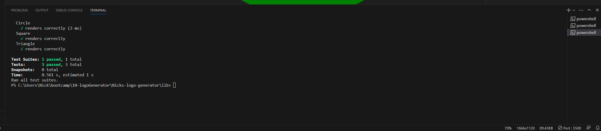
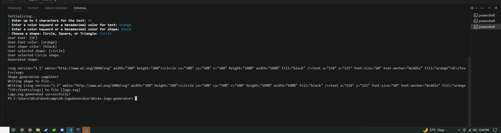

# Nick's Logo Generator

## Description:

The application enables users to enter inputs into a inquirer prompt in order to generate a logo "logo.svg" file which contains the users desired results as an SVG image.

## Table of Contents:

- [The Challenge](#the-challenge)
- [User Story](#user-story)
- [Acceptance Criteria](#acceptance-criteria)
- [Usage Instructions](#usage-instructions)
- [Challenge URL](#challenge-url)
- [Demonstration Video](#demonstration-video)
- [Screenshots](#screenshots)
- [Installation Process](#installation-process)
- [Built With](#built-with)
- [What I Learned](#what-i-learned)
- [Continued Development](#continued-development)
- [License & Copyright](#license--copyright)
- [Author](#author)

## The Challenge:

Build a Node.js command-line application that takes in user inputs to generates a SVG logo and saves it as "logo.svg" file. In addition, create a walkthrough video that demonstrates its functionality and the passing of all of the tests.

## User Story

```md
AS a freelance web developer
I WANT to generate a simple logo for my projects
SO THAT I don't have to pay a graphic designer
```

## Acceptance Criteria

```md
GIVEN a command-line application that accepts user input
WHEN I am prompted for text
THEN I can enter up to three characters
WHEN I am prompted for the text color
THEN I can enter a color keyword (OR a hexadecimal number)
WHEN I am prompted for a shape
THEN I am presented with a list of shapes to choose from: circle, triangle, and square
WHEN I am prompted for the shape's color
THEN I can enter a color keyword (OR a hexadecimal number)
WHEN I have entered input for all the prompts
THEN an SVG file is created named `logo.svg`
AND the output text "Generated logo.svg" is printed in the command line
WHEN I open the `logo.svg` file in a browser
THEN I am shown a 300x200 pixel image that matches the criteria I entered
```

## Usage Instructions

1. Open a terminal and navigate to the project directory.

2. Run the following command to start the SVG image generation process:
   <pre>node index.js</pre>
3. The tool will prompt you to enter the following details:

- Text content (up to 3 characters) for the logo.
- Font color for the text.
- Shape color for the selected shape (Circle, Square, or Triangle).
- Choose a shape from the provided options.

4. After providing the input, the tool will generate an SVG image with the specified text and shape. It will display the generated SVG in the terminal and save it as `logo.svg` in the project directory.

5. You can find the generated `logo.svg` image in the project directory, which you can use for branding or other purposes.

## Challenge URL:

[Complete Challenge URL Link:](https://github.com/NickUCLA/Nicks-logo-generator)

## Demonstration Video:

[Click Here to Watch]()

## Screenshots:

### Figure 1. Command line application


### Figure 2. Jest Testing "npm test"



### Figure 3. Generated "logo.svg" file



## Installation Process

1. Clone the repository: [Nick's Logo Generator](https://github.com/NickUCLA/Nicks-logo-generator)
2. Navigate to project directory.
3. Open terminal and run:
   <pre>npm install</pre>

## Built With

- JavaScript
- Node.js [Version 18.15.0](https://nodejs.org/en/blog/release/v18.15.0/)
- Jest [Version 29.4.3](https://www.npmjs.com/package/jest)
- Inquirer.js: [Version 8.2.6](https://www.npmjs.com/package/inquirer/v/8.2.6)
- Visual Studio Code: [Website](https://code.visualstudio.com/)

## What I Learned

- Develop a standalone application that utilizes the command node index.js in the terminal to create a logo and store it as an SVG file.
- Acquired proficiency in the JavaScript testing framework "Jest".

### Continued Development:

1. Create different types of files using node.
2. Add more shapes, colors, and text to the prompt for the rendered SVG images.

## License & Copyright ©

[](https://opensource.org/licenses/MIT) [Open Source Initiative Link](https://opensource.org/licenses/MIT)

## Author

Follow me on Github at [NickUCLA](https://github.com/NickUCLA)! Feel free to email me @nheal179@gmail.com with any questions or comments.

© 2023 [NickUCLA](https://github.com/NickUCLA). Confidential and Proprietary. All Rights Reserved.
